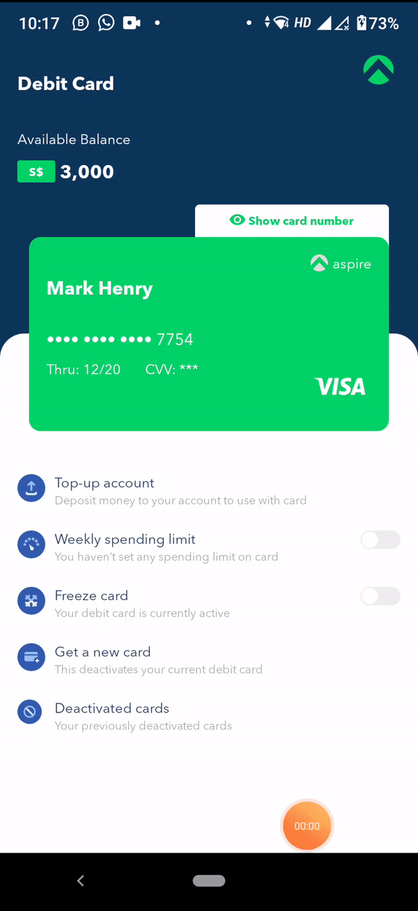

# AspireApp

A test app with 2 pages

## Install and run on android

```
npm install
cd AspireApp
npm run android
```

## Install and run on ios

```
npm install
cd AspireApp
npm run ios
```

## Test

```
npm test
```

Runs the jest test runner on your tests.



## Usage

The user Mark Henry's account details are visible in the homepage.
To view the card information, tap on `Show card number`. This will show the card number and cvv which was hidden. Tapping on `Hide card number` will hide this information again.

Tap on the switch near to `Weekly spend limit` and the Spend limit setting page will be loaded. Select one of the 3 options shown and press `Save`. This will redirect you back to the home page and now the spending limit indicator will be shown below the card.

To disable spending limit, Tap on the switch near `Weekly spend limit` again.

## Tech

Following technologies have been used:

- Redux (With Redux Toolkit)
- Redux-Saga
- Typescript
- Basic tests with jest (Used react-native-testing-library)

## Notes to reviewers

mockapi.io is used for api purposes.
Tokenisation is not implemented since there's no authorisation required in the app
